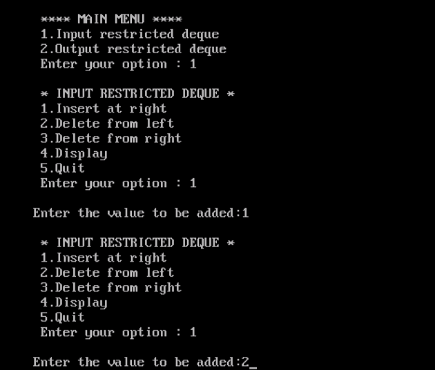
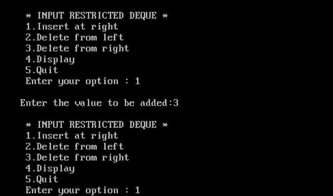
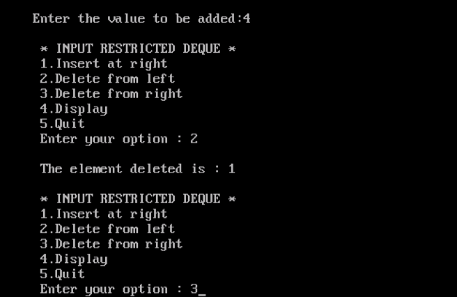
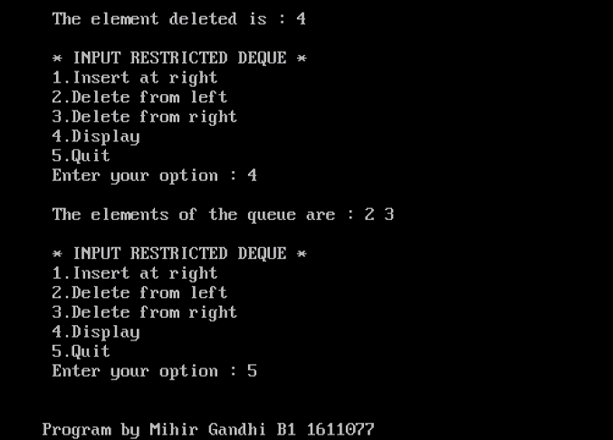
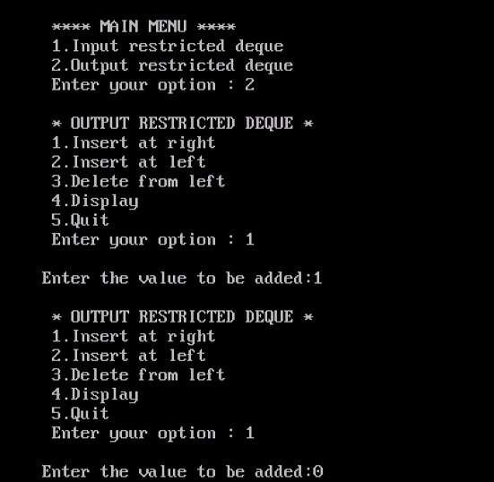
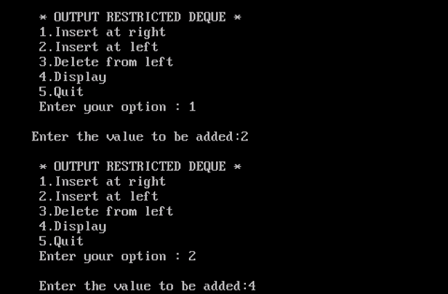
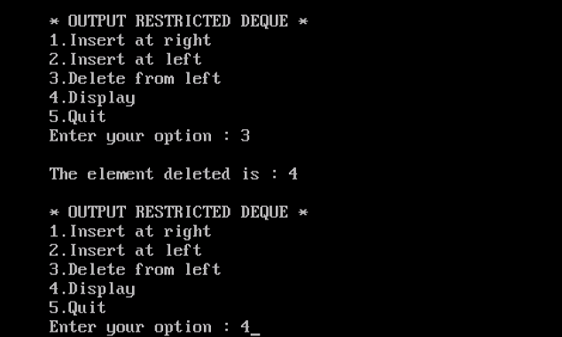
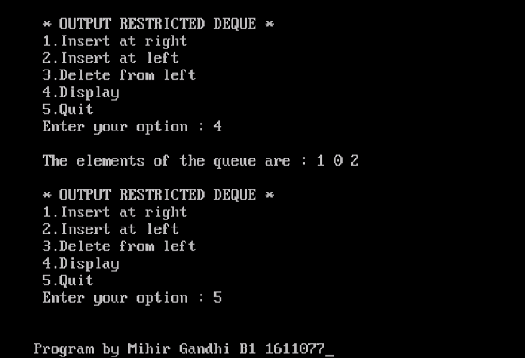

## Double Ended Queue

-----------------------------------------
### Problem Definition:
Write a program to implementat a double ended queue, or a deque.

A deque is a list in which the elements can be inserted or deleted at either end. It is also known as head-tail linked list, because the elements can be added or removed from either the front or the back. However, no element can be added or deleted from the middle of the list. 

There are 2 variants of double ended queue :
1. **Input restricted deque** : In this deque, insertions can be done only at one end while deletion can be done from both ends.
2. **Output restricted deque** : In this deque, deletion can be done only at one end while insertion can be done at both ends.

------------------------------------------
### Output:

* **Input Restricted Queue**

    

    

    

    

* **Output Restricted Queue**

    

    

    

    

