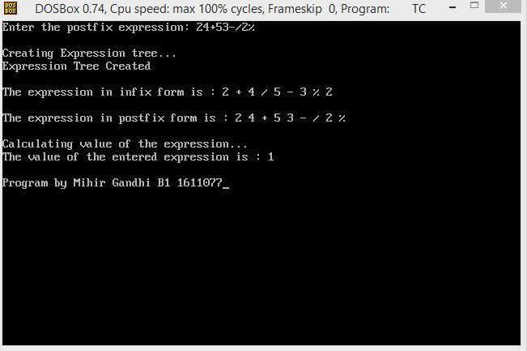

## Expression Tree

-----------------------------------------
### Problem Definition:
Write a program to implement a Binary Expression Tree using Postfix expression. 

A binary expression tree is a specific kind of a binary tree used to represent expressions. These trees can represent expressions that contain binary operators. The leaves of a binary expression tree are operands, such as constants or variable names, and the other nodes contain operators. 

    

------------------------------------------
### Output:

    

