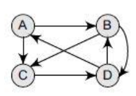
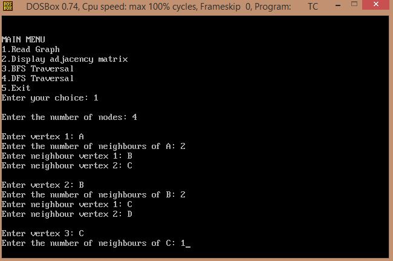
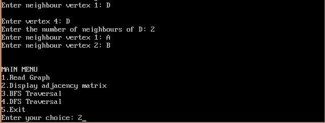
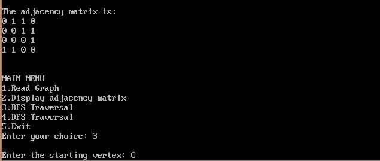
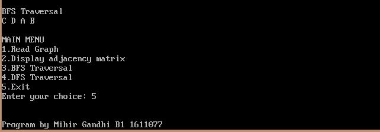
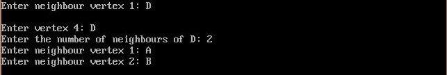
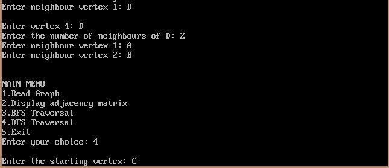
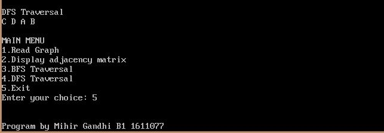

## Graph Traversal: BFS and DFS

-----------------------------------------
### Problem Definition:
Write a program to implement Breadth-first search (BFS) and Depth-first search (DFS) on a directed graph. 

    

------------------------------------------
### Output:

* **BFS Traversal**

    

    

    

    

* **DFS Traversal**

    

    

    

    

