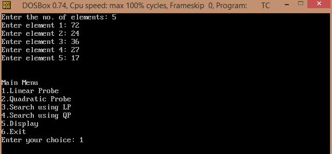
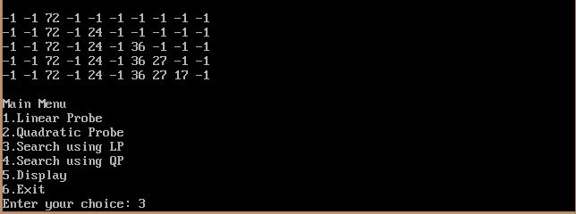
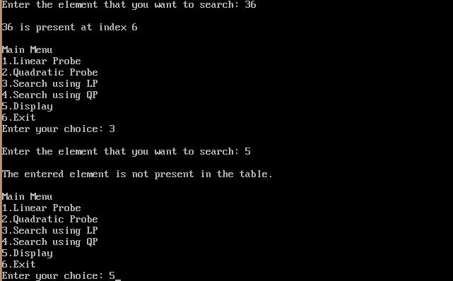
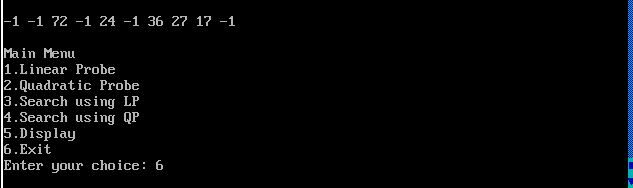
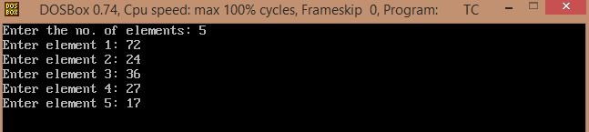
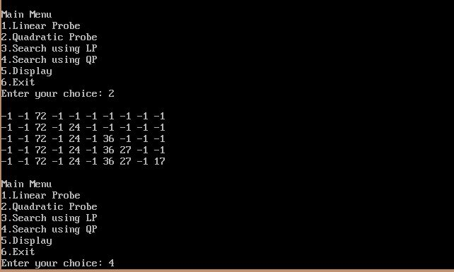
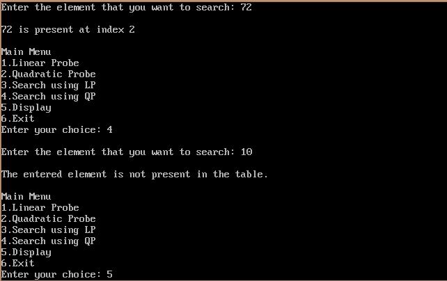
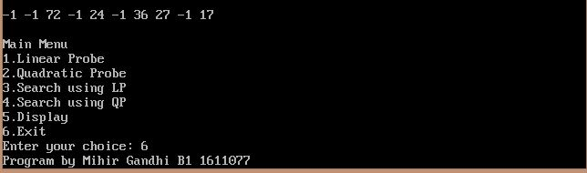

## Hashing with Collision Resolution

-----------------------------------------
### Problem Definition:
Write a program to implementat **Hashing** using 2 collision resolution methods - *linear probing* and *quadratic probing*.

------------------------------------------
### Output:

* **Linear Probing**

    

    

    

    

* **Quadratic Probing**

    

    

    

    

