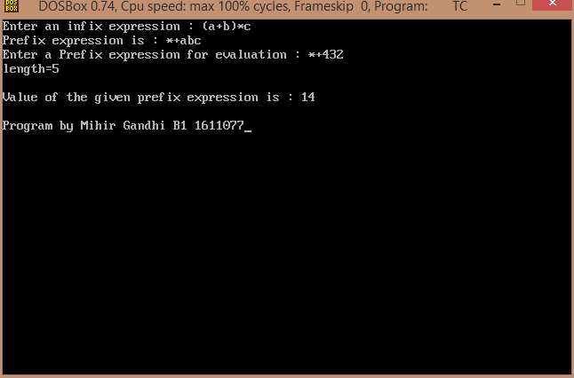

## Infix to Prefix Transformation and Evaluation

-----------------------------------------
### Problem Definition:
Write a program to implement *infix* to *prefix* transformation and evaluation of the prefix expression.

------------------------------------------
### Output:

    

