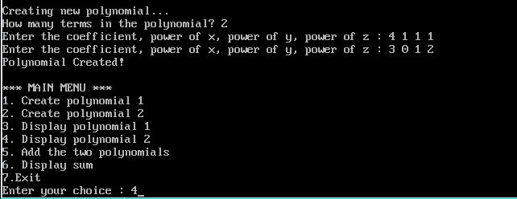

## Polynomial Addition using Linked List

-----------------------------------------
### Problem Definition:
Write a program to perform addition of polynomials in three variables using linked list.

------------------------------------------
### Output:

    

    

    

    

    

    

*** *The last term in the sum should be 3 x0 y1 z2. However, the term y2 was cropped out of the image. It is not an error in the code, the code will give the correct sum.*
