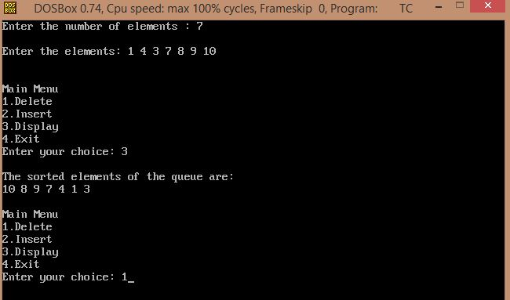
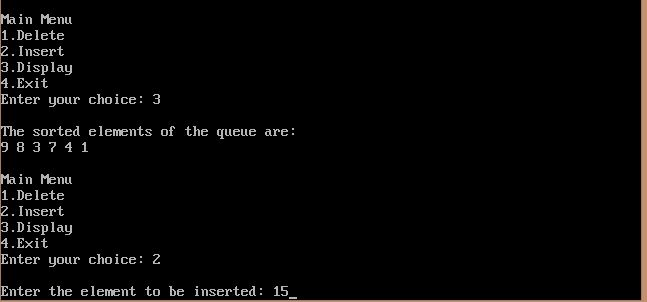
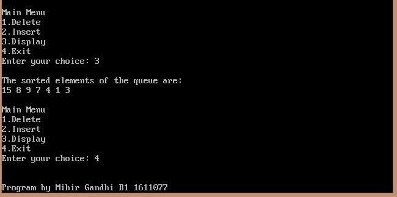

## Priority Queue using Heap

-----------------------------------------
### Problem Definition:
Write a program to implement a Priority Queue using Heap.

------------------------------------------
### Output:

    

    

    

