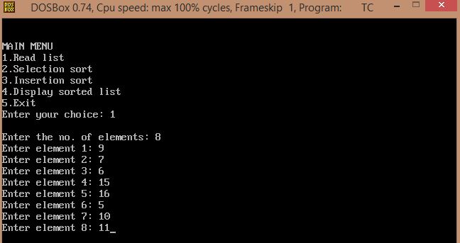
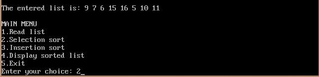
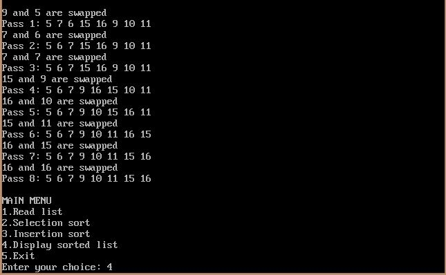
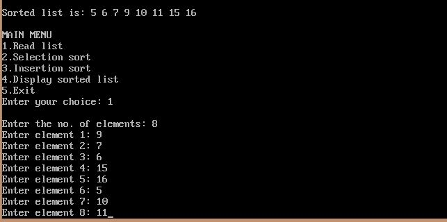
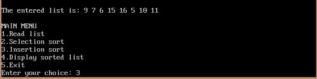
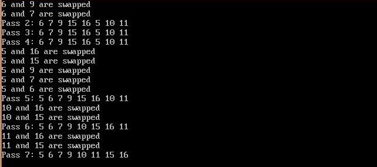
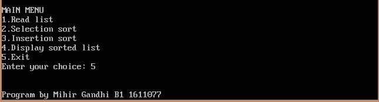

## Selection Sort and Insertion Sort

-----------------------------------------
### Problem Definition:
Write a program to implement Selection sort and Insertion sort on a given list of integers. 

------------------------------------------
### Output:

    

    

    

    

    

    

    

